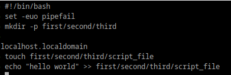
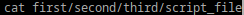
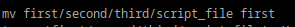
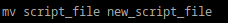
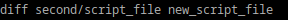
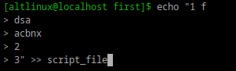
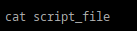
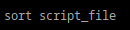

## 1. Что такое шебанг?
## Шебанг — это символы, размещённые в первой строке текстового файла, которые указывают операционной системе, какой интерпретатор (например, командная оболочка или язык программирования) нужно использовать для выполнения данного файла. Он состоит из последовательности символов #!, после которых указывается путь к интерпретатору.
## 2. Обязательно ли исполняемый файл дожен иметь соотвествующее расширение?
## В Linux исполняемый файл не обязан иметь какое-либо определённое расширение. В отличие от Windows, где расширение (например, .exe для исполняемых файлов) является важным признаком типа файла, в Linux это не имеет значения. Исполняемость файла определяется его правами доступа и содержимым, а не его расширением.
## 3.Напишите скрипт который выполнит автоматически действия из блока работы с файлами. 
## 
## 
## 
## 
## 
## 
## 
## 
##
## set -e: Этот флаг заставляет скрипт завершать выполнение при любой ошибке. Это помогает избежать дальнейших ошибок, так как скрипт сразу остановится, если что-то пойдёт не так.
## set -u: Этот флаг вызывает ошибку, если в скрипте используется необъявленная переменная. Это предотвращает ошибки, такие как опечатки в названиях переменных, и помогает сделать скрипт более надёжным.
## set -o pipefail: Этот флаг гарантирует, что если любая команда в пайпе (цепочке команд, соединённых с помощью |) завершается с ошибкой, то вся цепочка команд также завершится с ошибкой. Это полезно, чтобы отслеживать ошибки, которые могут возникать внутри пайпов, и не игнорировать их.