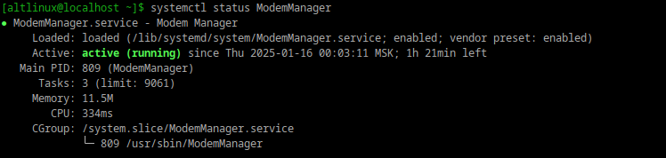
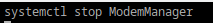
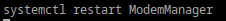
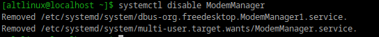
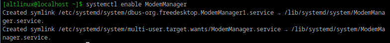

### Systemd юнит — это конфигурационный файл, используемый для управления различными аспектами системы, такими как службы, таймеры, монтирование файловых систем и другие ресурсы. Эти файлы определяют, как systemd будет управлять процессами и ресурсами в операционной системе.
## Статус
## 
## Остановка сервиса
## 
## перезапуск
## 
## удаление из автозагрузки 
## 
## возвращаем обратно
## 
##
### Таймеры позволяют запускать службы по расписанию (альтернатива cron).
