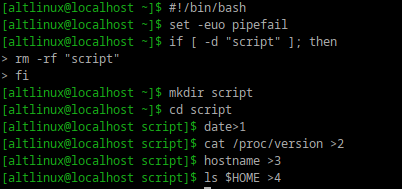
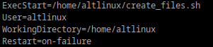
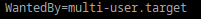
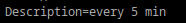
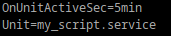
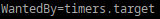
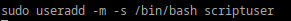

## Создайте скрипт который создаёт папку заполняет её файлами
## 
## Создайте юнит который будет вызывать этот скрипт при запуске. 
## [Unit]
## 
## [Service]
## 
## [Install]
## 
##  Создайте таймер который будет вызывать выполнение одноимённого systemd юнита каждые 5 минут.
## [Unit]
## 
## [Timer]
## 
## [Install]
## 
## От какого пользователя вызываются юниты по умолчанию?
## По умолчанию юниты в systemd выполняются от имени пользователя root
## Создаем пользователя
## 
## прописываем в сервис в блок [Service] User=scriptuser
##  Дополните ваш скрипт так, что бы он независимо от местоположения всега выполнялся в домашней папке того кто его вызывает.
## Для этого используем $HOME
