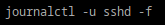
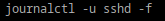

## Посмотрите журналы ssh
## Все журналы ssh
## 
## Журналы в реальном времени
## 
## Вывести журнал в реальном времени для службы sshd
## 
## Можно ли без команды journalctl прочитать логи systemd?
## Да, но это не так удобно. Логи systemd хранятся в бинарном формате в директории /var/log/journal/. Чтобы прочитать их без journalctl, можно воспользоваться утилитами для работы с бинарными файлами.
##  Сколько будет 2-2?
## 0