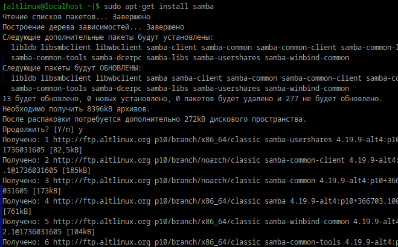
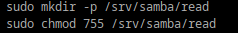

## установка samba
## 
### Общая папка — это каталог, доступ к которому могут получать пользователи локальной сети.
### Обмена файлами между устройствами.
### Хранения общедоступной информации, доступной всем в сети.
### Организации работы в командах.
## Создайте общую папку без пароля с правами только на чтение файлов
## 
### sudo mkdir /shared_read_only
### sudo chmod 755 /shared_read_only
## настройка
### [Read]
### path = /srv/samba/read
### browseable = yes
### read only = yes
### guest ok = yes
##  Создайте общую папку с паролем с правами на чтение и запись
### sudo mkdir -p /srv/samba/private
### sudo chmod 770 /srv/samba/private
## настройка
### [private]
### path = /srv/samba/private
### browseable = yes
### read only = no
### valid users = fgh
## Создайте общую папку с доступом для какой-то группы с полными правами
### sudo mkdir /shared_group
### sudo groupadd mygroup
### sudo chown :mygroup /shared_group
### sudo chmod 770 /shared_group
## Создайте общую папку в которой у одной группы будет полный доступ, а у другой только доступ на чтение. Третья группа не должна иметь к ней доступа
### sudo setfacl -m g:group1:rwx /shared_group_permissions
### sudo setfacl -m g:group2:rx /shared_group_permissions
### sudo setfacl -m g:group3:0 /shared_group_permissions
##
## 
## 
## 
##
