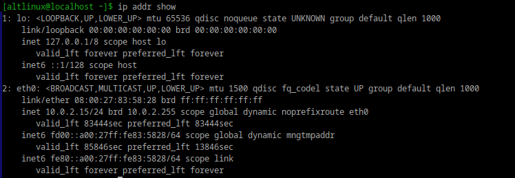
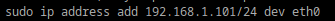
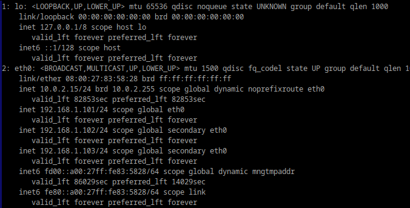
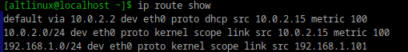
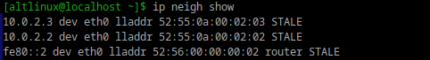

## Выведите список интерфейсов, какими способами можно это сделать?
## 
## так же можно использовать
## ip link show
##  Попробуйте изменить ip адрес
##  
## Попробуте добавить несколько ip адресов 
## 
## 
## Выведите список маршрутов
## 
## Выведите arp таблицу
## 
## Что такое ip адрес?
## IP-адрес (Internet Protocol address) — это уникальный адрес устройства в сети, который используется для его идентификации и обеспечения связи с другими устройствами.
## Для чего нужны маршруты?
## Маршруты определяют путь, по которому пакеты данных отправляются из одной сети в другую. Они необходимы для правильной доставки данных в сети, включая маршрутизацию через шлюзы и промежуточные узлы.
## Что за протокол arp?
## ARP (Address Resolution Protocol) — протокол, который используется для сопоставления IP-адресов с MAC-адресами устройств в одной сети. Это необходимо для передачи данных на канальном уровне.
## Что такое dhcp?
## DHCP (Dynamic Host Configuration Protocol) — протокол, который автоматически назначает IP-адреса, маску подсети, шлюзы и DNS-серверы устройствам в сети.
## Что такое dns?
## DNS (Domain Name System) — система, которая преобразует доменные имена в IP-адреса, необходимые для соединения.
## Как называется один из протоколов синхронизации времени?
## Один из наиболее распространённых протоколов — NTP (Network Time Protocol).
## Что такое широковещательный запрос, зачем он нужен?
## Широковещательный запрос отправляется всем устройствам в сети (broadcast) для получения определённой информации. Например, ARP использует такие запросы для получения MAC-адреса устройства.
## Какой адресс является широковещательным?
## Широковещательный адрес — это последний адрес в диапазоне подсети. Например, для подсети 192.168.1.0/24, широковещательный адрес — 192.168.1.255.
## Какие ещё параметры можно задать сетевой карте?
## MAC-адрес, MTU (размер пакета), Включение/отключение интерфейса
## Что такое маска подсети? зачем она нужна?
## 15. Что такое маска подсети и зачем она нужна?
## Маска подсети разделяет IP-адрес на две части:
## Сетевой адрес (идентификатор сети).
## Хостовый адрес (идентификатор устройства в сети).
## Маска подсети необходима для определения диапазона адресов, принадлежащих одной сети.

