## Работа в консольке
## 1 перемещаемся в домашнию дерикторию cd~
## 2 выводим список файлов в дериктории ls
## 3 выводим все файлы в дериктории ls -a
## 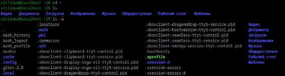
## 4 создаем папку с подпапкой с помощью mkdir
## 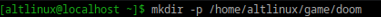
## 5 внутри папки создали файл и написала туда hello world
## 
## 6 перемещаем файл
## 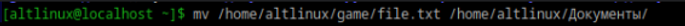
## 7 копируем файл из одной директории в другую
## 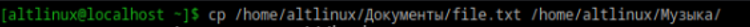
## 8 переимновываем файл с помощью mv
## 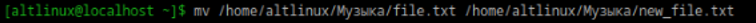
## 9 сравниваем файлы
## 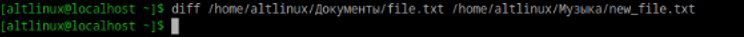
## они одинаковые 
## 10 сортировка 
## 
## 
## 11 удаление файлов и папок
## 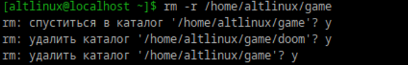

## Перенаправляем
## 1
## ">" ">>" используются для перенаправления вывода
## ">" для перезаписи
## ">>" для добавления в конец
## 2 перенаправление используется для измениния
## потоков. Srderr стандартный поток ошибок.
## Стандартный вывод srdout - вывод на экран
##  3 содержимове файла без текстового редактора
## 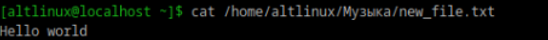
## 4 создаем файл с содержимым без текстового редакотора
## 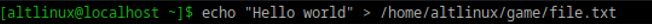
## 5 
## Сохраняем обычный вывод в stdout.txt, ошибки в stderr.txt
## 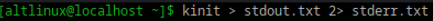
## отключает весь вывод, перенапрваляя его в пустоту
## 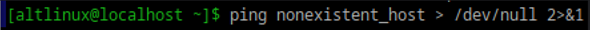
## обычный вывод в output.txt, ошибки в errors.txt
## 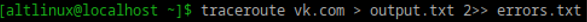
## 6
## stdout это стандартный вывод, выводит результаты команд
## stderr это стандартный поток ошибок, вывод ошибки
## при выполении команд
## 7
## stdin стандартный ввод, откуда комнда получает данные
## обычно это клавиатура
## 8
## Перенаправляем весь вывод в пустоту
## 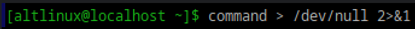