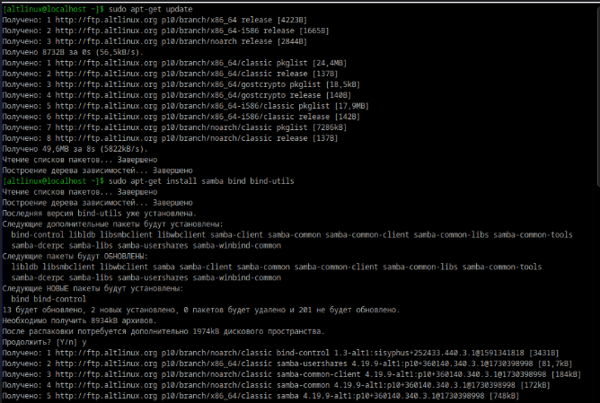
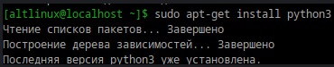
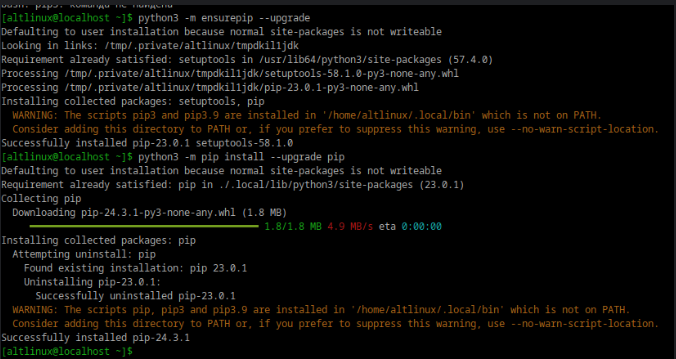
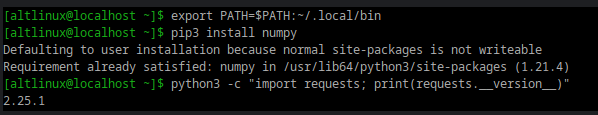
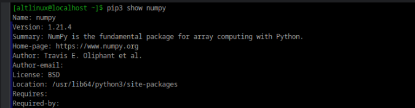
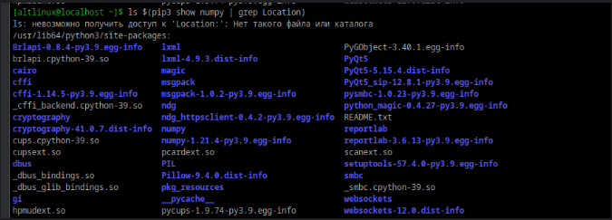
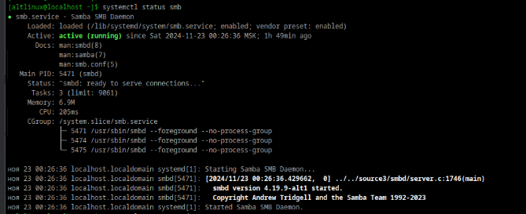
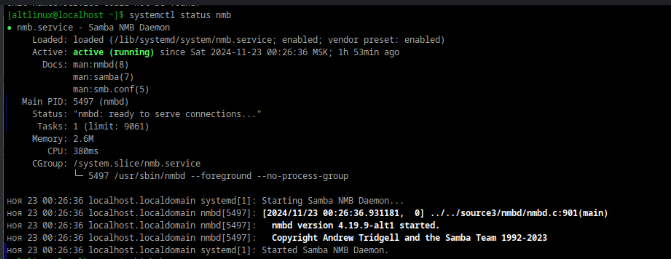
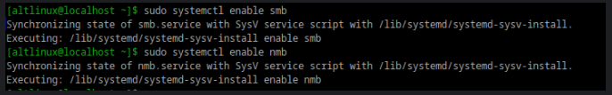
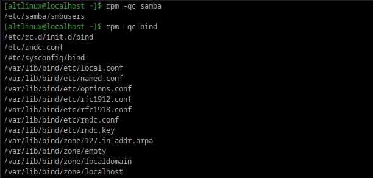

## 1
## установка samba bind bind-utils
## 
## установка python и pip(вручную с помощью пайтон)
## 
## 
## установка numpy
## 
## 2
## версия пакета 
## 
##  Файлы пренадлежащие пакету
## 
## Зависимости
## 
## 3
## службы запущены
## 
## 
##  добавление в автозагрузку
## 
## можно включить и добавить
## в автозагрузку одной командой
## 
## 4 
##  конфигурационные файлы пакетов
## 
