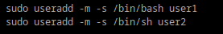
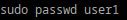
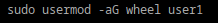
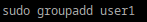
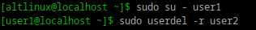

## 1. Добалвение пользователей и установка паролей
## 
## 
## 
## 2. Назначение групп пользователям
### добавим user1 в админы
## 
## Создадим группу и потом добавим в нее пользователя 
## 
## 
## 3. В Linux права доступа определяют, кто и что может делать с файлами и папками.Их всего 3.
### Чтение (r)  содержимое файла или список файлов в папке.
### Запись (w) позволяет изменять файл или добавлять/удалять файлы в папке.
### Исполнение (x) позволяет запускать файл как программу или заходить в папку.
### Типы пользоватлей
### Владелец (owner) 
### Группа (group) 
### Другие (others)
## 4. Права доступа к файлам
### Для просмотра прав доступа на файлы и каталоги в домашней директории пользователя
## 
###  Для изменения прав доступа существует команда `chmod`
## 5. Учётная запись встроенного администратора называется root.
## 6. Как выполнить команду от имени администратора?
### Нужно использовать sudo перед командой
## 7. Есть ли ограничения у суперпользователя?
### Суперпользователь root обладает практически неограниченными правами в системе, но может столкнуться с некоторыми ограничениями, обусловленными механизмами защиты системы от случайных или неправильных действий (например, нельзя отформатировать корневую файловую систему, если она смонтирована).
## 8. Удаление пользователя 
## 
## 9.Как можно изменить владельца папки?
### Измненить владельца папки можно с помощью команды chown
##
##
##
##
##
##
##

