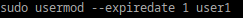

## Запрет пользователю на вход в систему
## блокировка пользователя
## 
## отключение учетной записи
## 
## Можно ли создать пользователей с одинаковыми именами?
### НЕТ
### Имена пользователей уникальны

